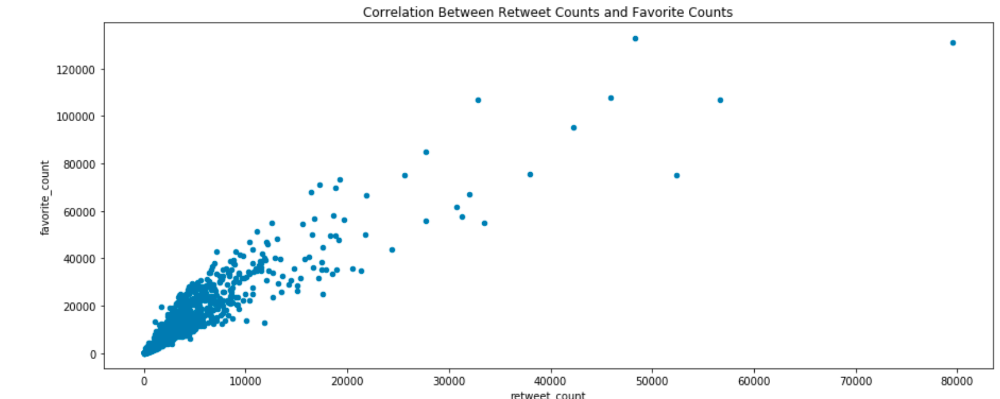
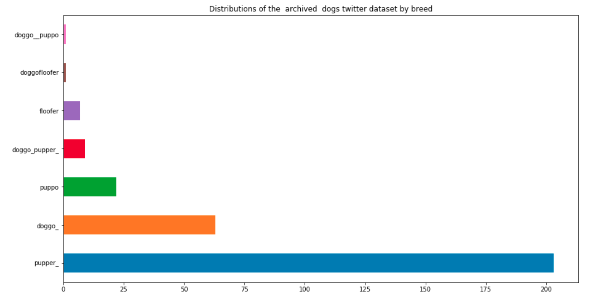

### Preamble
Could you guess what rating the above dog could get and how many retweet count could it receive? That is what **WeRateDogs** does.
One of the regular routines of a data analyst is data wrangling. It has been observed that over 80 percent of data analysis efforts are spent in data wrangling and cleaning, hence, the great importance attached to data preparations. There are three main stages of data wrangling were employed in pre-processing data gathered from **WeRateDogs tweets**. They are:
* Gathering data
* Assessing Data for Quality and Tidiness Issues and
* Cleaning data for meaningful usage or analyses.

### Wrangling

More often than not, the data is not available and must first and foremost be gathered. This project was not an exception to the situations where there was no data and so data was collected from three different sources via three different approaches, namely: downloading and uploading data, web scraping using **requests** library and using twitter API to get data from tweet data. Gathering these datasets were followed by assessing them to detect quality and tidiness problems. A number of quality issues were observed including missing values, presence of None values, inconsistency in string (text) data format where some are in lowercase and others in capitalized form. Tidiness problems such as duplicated data and improper representations of some features in different columns which ought to be collapsed  into a single column. The aforementioned issues and others were taken care of in the data cleaning stage. 

### Results/Insights

The three gathered, assessed and cleansed datasets are all about the data from **WeRateDogs**. They are the archived dataset, image prediction and retweet counts and favorite datasets. In the archived datasets, the following insights were obtained:

1. The archived twitter dataset has 306 dogs with known breed names where the most popular breed is pupper (203 dogs). 1688 dogs do not have their breeds known or predicted.

2. The source of most dogs in the archived twitter dataset is from 
 **"http://twitter.com/download/iphone"**.  1955 of them are from this source which represents over 98 % of all the archived dog datasets.
 
3. The contents of each tweet as shown in  the 'text' column is unique
4. The most popular dog p1 value (name) is Golden Retriever (139) followed by Labrador Retriever

The scatter plot below shows the correlation of the retweet_count and favorite_count from the twitt dataset. It clearly shows that there is strong positive correlation between the two variables with over 94 % of the retweet_counts being less than 10000 and most favorite counts are less than 30000. 

The chart below shows the distribution of dog breeds in the dataset.

